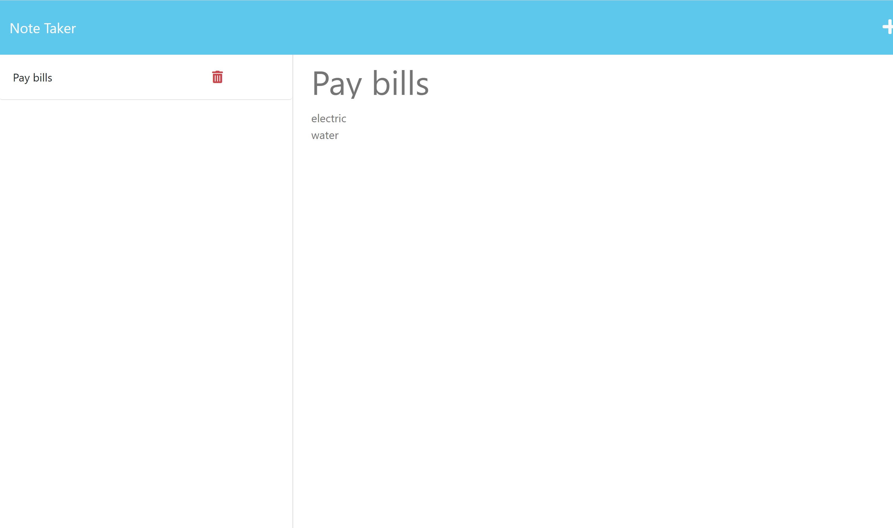

# Note Taker

 
## Description
This node application uses express for the backend to save and retrieve note data. Notes created by the user will be stored in a json file. The JSON file will be used to retrieve the note information when clicked from the list or removed when the user clicks the delete icon.
 
   ## Table of Contents 
   - [Installation](#installation)
   - [usage](#usage)
   - [License](#license)
   - [Contributing](#contributing)
   - [Tests](#tests)
   - [Questions](#questions)
 

   ## Installation Instructions
   - node 
   - express
   -uuid (package for creating unique ids)
 

   ## Usage
   - Install correct packages needed.
   - Run nodeserver.js
   - Save note with save icon
  
  
   
  

   
  

   ## Contributing
   Contributions are welcome. 
   Please submit a pull request at https://github.com/cjsolis12
 
   
 
   ## Questions
   If you have any questions, please contact me using the following information:
 
   GitHub username: https://github.com/cjsolis12
 
   Email address: cjelizondo12@gmail.com
